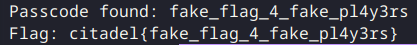
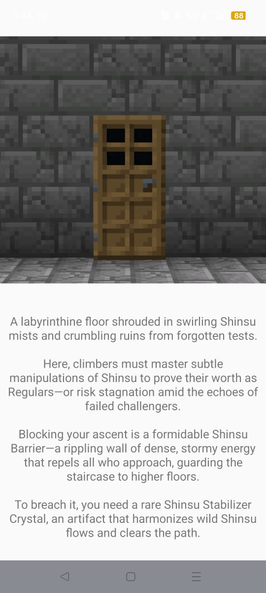
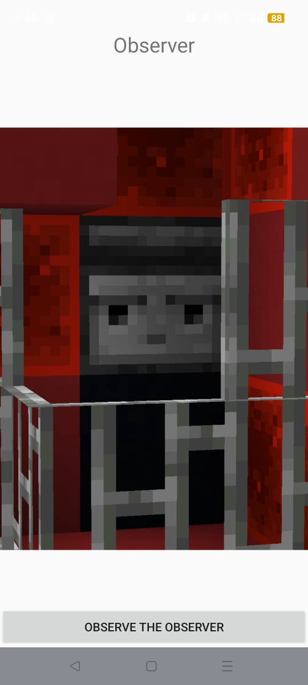
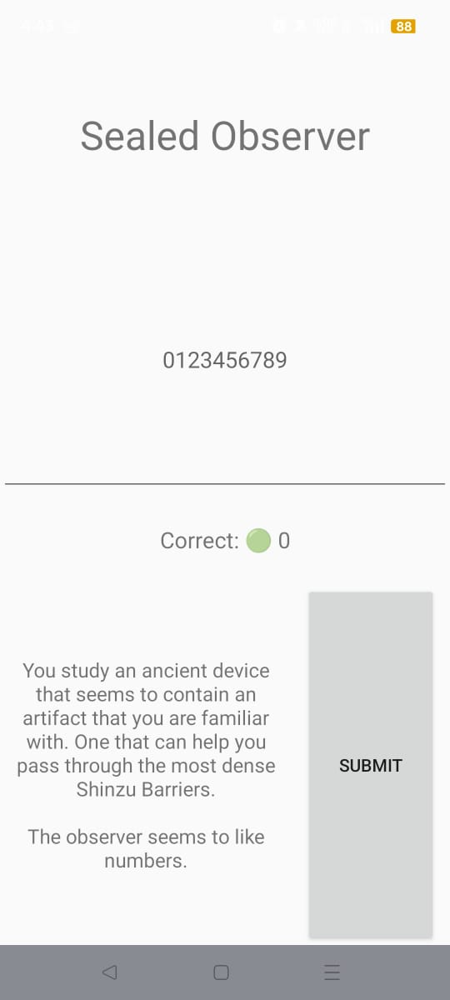
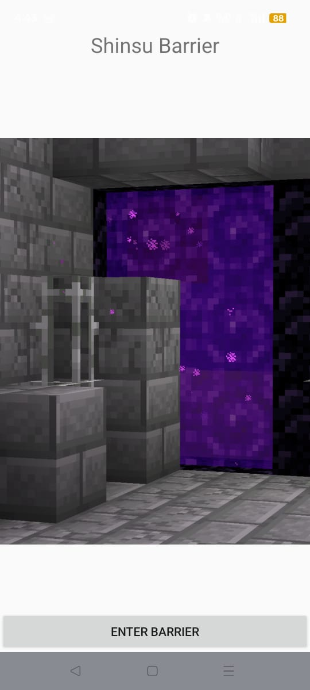
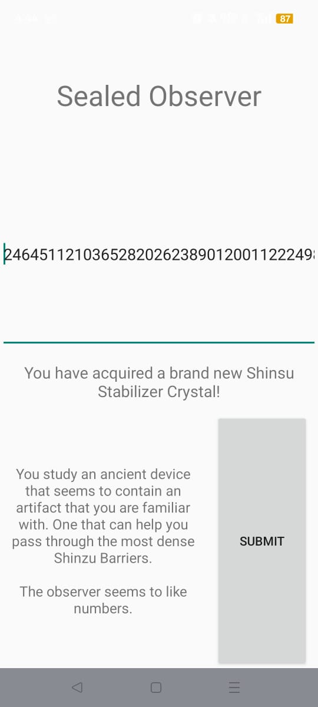
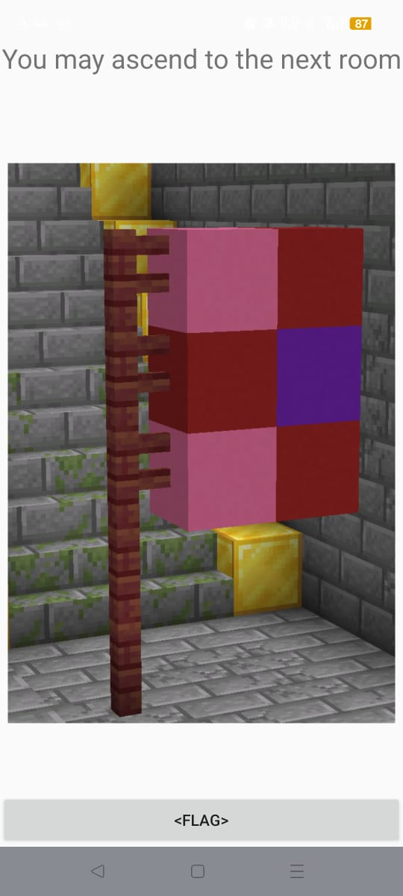
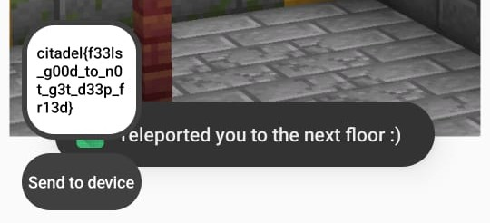

# Challenge: The Ripper

The guardian of this floor steps from the shadows. Known only as Jack the Ripper, he watches you carefully. He proclaims himself merciful and hands you a word list to help.
He asks you to find the passcode hidden in this hash `$2a$04$RNoyoWAcW0StwSri4YN1Eeb2j1gBNKutDOMxsLzfyfSvB/ghMHToa`. The word list is your only aid. Only by combining the two correctly can you uncover the key and move on to the next floor. Flag format: `citadel{password}`

[hash.txt](The_Ripper/hash.txt)
[wordlist.txt](The_Ripper/wordlist.txt)

## Solution:

On analysing the hash with any tool, we can see that it is a bcrypt hash. Since we  have been given a list of possible passwords, we can bruteforce this using a python script.



[abra.py](The_Ripper/abra.py)

## Flag: 

```
citadel{fake_flag_4_fake_pl4y3rs}
```

# Challenge: BRATCHA

A clear chime rolls through the chamber and a new crest ignites on your badge – a quiet promotion. The outer ring is behind you. From here, the Citadel opens its inner systems, and the locks grow heavier because the keys are worth more. Your answers now carry more weight – and earn more in return. The citadel welcomes you to the inner climb.

Near the gate to the next floor you come across a CAPTCHA verification test, but it has been covered by scratches on the decaying wall and misleading letters stopping you from finding the correct key, all to prove you’re human.


## Solution:

The image provided in the challenge containes a jumbled up link to a pastebin page. To capture the flag, it is nessesary to figure out the correct link. We can observe that the link will be of the format `pastebin.com/(s/c)(q/g)(x/y)(h/n)(x/v)(B/D)(h/n)(S/Z)` where `(a/b)` would represent that that character can be either `a` or `b`. This gives us 256 different possibiliies. Perfectly within range for a brute force attempt.

I initially tried to use a python script for the bruteforcing but I kept getting `403` errors because of pastebin blocking my attempts and I thought it would be simpler to just do it manually. I used a python script to write all the possible links into a text file. Then, I opened them all in firefox using the following link:

```sh
$ while read line; do firefox --new-tab "$line"; done < list.txt
```

Then, I just kept pressing `Ctrl+W` till I found the right page.


[listall.py](BRATCHA/listall.py)
[list.txt](BRATCHA/link.txt)

## Flag: 

```
citadel{1m_3v3rywh3r3_1m_s0_jul1a}
```

# Challenge: Shinsu DEXquest

As you climb the path, a guardian emerges, its form shifting between the visage of a long-dead climber and a metallic sentinel. It moves with a strange grace, holding out a cartridge containing a single file. You realize the file is compatible with the device you carry and may be the key to continue your ascent toward the Citadel’s heart.

[dexquest.apk](Shinsu_DEXquest/dexquest.apk)

## Solution:

This challenge is acompanied with an apk file. When you install the apk, an app with the title `DEXterity Quest` will be added to the device.


On running the app, you will be greeted by the following `home screen`:



If you swipe left, you will see the `observer` screen:



If you choose to `observe the obseverver`, you will find the `sealed observer`:



Here, you will need to enter a code to obtain the `shinsu stabiliser crystal`, but thats for later. If you instead swiped right from the `home screen`, you would find the `shinsu barrier`:



If you choose to `enter the barrier` without a `shinsu stabiliser crystal`, you will be `deepfried` and the app will quit:


To actually capture the flag, we must find the code required to unlock the `sealed observer` and get the `shinsu stabiliser crystal`. To this, I used `JADX` to reverse engineer the apk. After abit of looking around, I was able to find the `correctDigits` function. This function is responsible for checking if the code is valid or not.

<details closed>
<summary><i>The Function(Very Long)</i></summary>

```java
private final int correctDigits(String input) {
    String num = StringsKt.padStart(input, 99, '0');
    EditText editText = this.inputNum;
    if (editText != null) {
        editText.setText(num);
    }
    int green = 0;
    if (num.charAt(8) == '1') {
        green = 0 + 1;
    }
    if (num.charAt(25) == '2') {
        green++;
    }
    if (num.charAt(81) == '0') {
        green++;
    }
    if (num.charAt(47) == '5') {
        green++;
    }
    if (num.charAt(35) == '8') {
        green++;
    }
    if (num.charAt(0) == '2') {
        green++;
    }
    if (num.charAt(53) == '0') {
        green++;
    }
    if (num.charAt(74) == '8') {
        green++;
    }
    if (num.charAt(67) == '3') {
        green++;
    }
    if (num.charAt(49) == '1') {
        green++;
    }
    if (num.charAt(7) == '2') {
        green++;
    }
    if (num.charAt(78) == '2') {
        green++;
    }
    if (num.charAt(46) == '5') {
        green++;
    }
    if (num.charAt(9) == '0') {
        green++;
    }
    if (num.charAt(20) == '3') {
        green++;
    }
    if (num.charAt(91) == '2') {
        green++;
    }
    if (num.charAt(85) == '8') {
        green++;
    }
    if (num.charAt(15) == '2') {
        green++;
    }
    if (num.charAt(57) == '7') {
        green++;
    }
    if (num.charAt(66) == '9') {
        green++;
    }
    if (num.charAt(31) == '2') {
        green++;
    }
    if (num.charAt(14) == '8') {
        green++;
    }
    if (num.charAt(34) == '9') {
        green++;
    }
    if (num.charAt(58) == '4') {
        green++;
    }
    if (num.charAt(69) == '9') {
        green++;
    }
    if (num.charAt(30) == '2') {
        green++;
    }
    if (num.charAt(37) == '1') {
        green++;
    }
    if (num.charAt(95) == '2') {
        green++;
    }
    if (num.charAt(32) == '2') {
        green++;
    }
    if (num.charAt(50) == '1') {
        green++;
    }
    if (num.charAt(80) == '8') {
        green++;
    }
    if (num.charAt(86) == '9') {
        green++;
    }
    if (num.charAt(63) == '9') {
        green++;
    }
    if (num.charAt(64) == '2') {
        green++;
    }
    if (num.charAt(79) == '5') {
        green++;
    }
    if (num.charAt(98) == '5') {
        green++;
    }
    if (num.charAt(90) == '7') {
        green++;
    }
    if (num.charAt(92) == '3') {
        green++;
    }
    if (num.charAt(72) == '3') {
        green++;
    }
    if (num.charAt(13) == '2') {
        green++;
    }
    if (num.charAt(28) == '1') {
        green++;
    }
    if (num.charAt(11) == '6') {
        green++;
    }
    if (num.charAt(70) == '4') {
        green++;
    }
    if (num.charAt(17) == '2') {
        green++;
    }
    if (num.charAt(21) == '8') {
        green++;
    }
    if (num.charAt(96) == '6') {
        green++;
    }
    if (num.charAt(82) == '7') {
        green++;
    }
    if (num.charAt(44) == '5') {
        green++;
    }
    if (num.charAt(71) == '7') {
        green++;
    }
    if (num.charAt(51) == '8') {
        green++;
    }
    if (num.charAt(19) == '2') {
        green++;
    }
    if (num.charAt(83) == '4') {
        green++;
    }
    if (num.charAt(41) == '4') {
        green++;
    }
    if (num.charAt(52) == '5') {
        green++;
    }
    if (num.charAt(76) == '5') {
        green++;
    }
    if (num.charAt(48) == '2') {
        green++;
    }
    if (num.charAt(26) == '0') {
        green++;
    }
    if (num.charAt(55) == '6') {
        green++;
    }
    if (num.charAt(56) == '9') {
        green++;
    }
    if (num.charAt(16) == '0') {
        green++;
    }
    if (num.charAt(6) == '1') {
        green++;
    }
    if (num.charAt(12) == '5') {
        green++;
    }
    if (num.charAt(27) == '0') {
        green++;
    }
    if (num.charAt(97) == '2') {
        green++;
    }
    if (num.charAt(62) == '8') {
        green++;
    }
    if (num.charAt(45) == '3') {
        green++;
    }
    if (num.charAt(29) == '1') {
        green++;
    }
    if (num.charAt(39) == '6') {
        green++;
    }
    if (num.charAt(42) == '8') {
        green++;
    }
    if (num.charAt(18) == '6') {
        green++;
    }
    if (num.charAt(2) == '6') {
        green++;
    }
    if (num.charAt(1) == '4') {
        green++;
    }
    if (num.charAt(89) == '2') {
        green++;
    }
    if (num.charAt(24) == '1') {
        green++;
    }
    if (num.charAt(54) == '9') {
        green++;
    }
    if (num.charAt(61) == '1') {
        green++;
    }
    if (num.charAt(65) == '1') {
        green++;
    }
    if (num.charAt(4) == '5') {
        green++;
    }
    if (num.charAt(38) == '4') {
        green++;
    }
    if (num.charAt(36) == '7') {
        green++;
    }
    if (num.charAt(40) == '8') {
        green++;
    }
    if (num.charAt(75) == '0') {
        green++;
    }
    if (num.charAt(94) == '8') {
        green++;
    }
    if (num.charAt(23) == '0') {
        green++;
    }
    if (num.charAt(33) == '4') {
        green++;
    }
    if (num.charAt(5) == '1') {
        green++;
    }
    if (num.charAt(87) == '4') {
        green++;
    }
    if (num.charAt(68) == '0') {
        green++;
    }
    if (num.charAt(60) == '9') {
        green++;
    }
    if (num.charAt(73) == '5') {
        green++;
    }
    if (num.charAt(93) == '9') {
        green++;
    }
    if (num.charAt(43) == '1') {
        green++;
    }
    if (num.charAt(3) == '4') {
        green++;
    }
    if (num.charAt(84) == '7') {
        green++;
    }
    if (num.charAt(22) == '9') {
        green++;
    }
    if (num.charAt(88) == '2') {
        green++;
    }
    if (num.charAt(10) == '3') {
        green++;
    }
    if (num.charAt(77) == '8') {
        green++;
    }
    if (num.charAt(59) == '8') {
        green++;
    }
    if (green == 99) {
        password = input;
        return green;
    }
    return RangesKt.random(RangesKt.until(0, green), Random.INSTANCE);
}
```
</details>

For the correct code, the value of the `green` variable must be 99 by the end. Using this, I was able to find the code:
`246451121036528202623890120011222498714684815355211850969748918921930947358058258074789422723982625`
Now, if we enter this in the `sealed observer` page, we will obtain the `shinsu stabiliser crystal`:



Now, if we try to pass through the barrier, we will be taken to the `flag` page where the flag can be captured.





## Flag: 

```
citadel{f33ls_g00d_to_n0t_g3t_d33p_fr13d}
```
