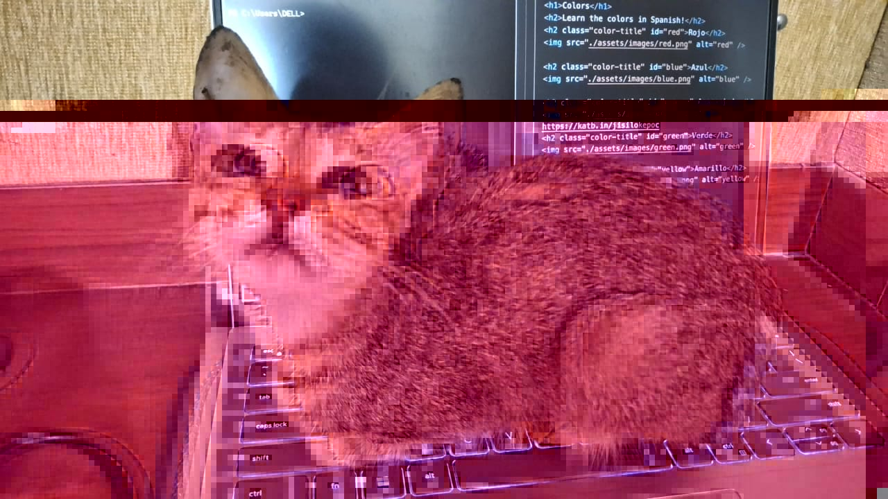
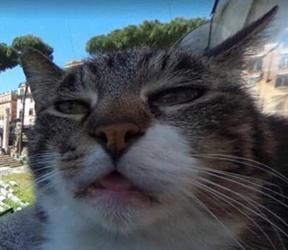

# Challenge: Not The Only Cat

## Description:

Oh you must really look into the CAT.



## Solution:

In this challenge, we have been given a somewhat glitched image of a cat. First, I started by viewing the metadata of the image provided to make sure there is nothing is there. Then, I tried using binwalk and cyberchef to make sure there were no files hidden in it.

I then uploaded the image to [Forensically](https://29a.ch/photo-forensics/) to try and analyse the image in other ways. Using the magnifier tool, I managed to spot a link on one of the monitors in the background: [https://katb.in/jisilokepoc](https://katb.in/jisilokepoc). There, I found the text string `Y3Rme3RoM19o` which I put into cyberchef and used the magic tool to get the first half of the flag `ctf{th3_h`.

Back on the `Forensically` website, I was able to use the string extraction tool to get the 2nd part of the flag `1dd3n_k4t}kernel`.

## Flag: 

```
ctf{th3_h1dd3n_k4t}kernel
```

### References:

- [Forensically](https://29a.ch/photo-forensics/
- [CyberChef](https://gchq.github.io/CyberChef/)


# Challenge: Fiesty Hunt

## Description:

Because of me... every cipher is insecure! Every print statement must die!

[CTFQ.py](CTFQ.py)
[output.txt](output.txt)

## Solution:

By looking at the source code provided in `CTFQ.py`, we can see that the code is implementing a sort of `fiestal cipher`. the script splits the input into halves and iterates with round keys derived from chunks of the secret flag. `output.txt`: contained 13 printed binary strings (one per round).

The Feistel round function was:

- Input: `(l0, r0)`
- Round key: `k`
- Update:
  - `r1 = l0 ⊕ r0 ⊕ k`
  - `l1 = r0`
- Output: printed `(r1 | l1)`

Thus, each printed line `S_i` was the state `(r_i | l_i)`.

We noticed a useful recurrence:

```
k_i = left(S_i)  ⊕  left(S_{i-1})  ⊕  right(S_{i-1})
```

- `left(S_i)` = `r_i`
- `left(S_{i-1})` = `r_{i-1}`
- `right(S_{i-1})` = `l_{i-1}`

This formula allowed recovering all round keys except the first one, because we never saw the initial state `(l0, r0)`.

From the printed 13 states, we recovered 12 keys (k2 … k13) but the first 5-byte chunk of the flag (`k1`) was not directly recoverable. Since we knew that the flag will be of the form  `ctf{.....}kernel`, we can brute-force the missing 5th byte after `"ctf{"`.

For each candidate, we can reconstruct the initial state and simulate all rounds. Only the correct candidate will reproduce every printed state. On using a python script to do all this, we can find that the correct first key was `"ctf{o"`. on combining with the recovered middle part and final `"rnel"`, the full flag is: `ctf{ohhh_r0unD_n_round_vgoo_ho1dinG_ON2pain_fu3led_by_our_EG0s}kernel`.

[fiestalFlag.py](fiestalFlag.py)

## Flag: 

```
ctf{ohhh_r0unD_n_round_vgoo_ho1dinG_ON2pain_fu3led_by_our_EG0s}kernel
```

# Challenge: Litter Doxx

## Description:

I love this car can you help me find it flag is ctf{his name_the month and year this photo was taken}kernel

format: ctf{Name_MonthYear}kernel



## Solution:

In this challenge, we have been given an image of a cat. If we use reverse image search on the cat, we will be able to find that the cat is somewhat internet famous for having made an appearance on google maps and for his facial expression in the image. There, we should be able to find that the image was actually taken in `April 2017` at the `Largo di Torre Argentina` in `Rome`, aka the `Torre Argentina Cat Sanctuary`. After abit more searching, we should be able to find the official website for the cat santuary: [Torre Argentina Cat Sanctuary](https://www.gattidiroma.net/web/en/).

If we look around on the website, we can see that there is a `Cat Stories` page which is filled with stories of cats who are available for adoption. Since the image was taken so long ago, we will not be able to find the correct cat here. Instead, we need to check this website on the web archive. If you check this page on the oldest date available of `2 May, 2019`, you will be able to find that the cats name is `Eusebio`: [Eusebio On The Torre Argentina Cat Sanctuary website](https://web.archive.org/web/20190502174301/https://www.gattidiroma.net/web/en/distance-cat-adoption-from-rome-largo-argentina-cat-sanctuary/).

Thus, we can reconstruct the flag `ctf{Eusebio_April2017}kernel`.

## Flag: 

```
ctf{Eusebio_April2017}kernel
```
